Single-cell morphological profiling and analysis of astrocyte terminal
differentiation
================
Raphaëlle Luisier, Idiap Research Institute, Martigny, Switzerland
June 2024

  - [1. Experimental set-up](#1-experimental-set-up)
  - [2. Explore data](#2-explore-data)
      - [2.1 Number of detected cells per
        wells](#21-number-of-detected-cells-per-wells)
      - [2.2 Location of the detected object in the
        image](#22-location-of-the-detected-object-in-the-image)
  - [4. Unsupervised data analysis](#4-unsupervised-data-analysis)
      - [4.1 Create data and variable
        matrices](#41-create-data-and-variable-matrices)
      - [4.2. Inspect correlation between variables extracted from
        fluorescent
        images](#42-inspect-correlation-between-variables-extracted-from-fluorescent-images)
      - [4.3 Singular value decomposition
        analysis](#43-singular-value-decomposition-analysis)
          - [4.3.1 Which component captures the treatment effect over
            time](#431-which-component-captures-the-treatment-effect-over-time)

### 1\. Experimental set-up

iPSC-derived astrocytes were cultured in 96-well plates for 21 days and
fluorecent images were taken after 0, 1, 7, 14 and 21 days in culture.
The cells were treated with the following three different treatment
(except at day 0 where all wells are expected to be the same) were :

1.  **No treatment**: D1-D7.
2.  **CNTF treatment**: A1-A7.
3.  **BMP4 treatment**: B1-B7.
4.  **CNTF+BMP4 treatment**: C1-C7

Half of the astrocytes were transfected with a GFP under the CMV
promoter which provides the highest expression activity in the broadest
range of cell types. Only half of the plated cells contain the GFP in
order to be able to detect cells.

There are 4 images per well per time-point. Images are overlapping
(about 5% at the edges) to ensure the appropriate recontruction of the
full image.

### 2\. Explore data

#### 2.1 Number of detected cells per wells

The number of detected object, i.e. astrocytes, per image should in
principle stay constant over time since the cells are not undergoing
proliferation nor cell death. However as shown in the next figure the
number of detected objects per well decreases over time indicating cell
death over time.

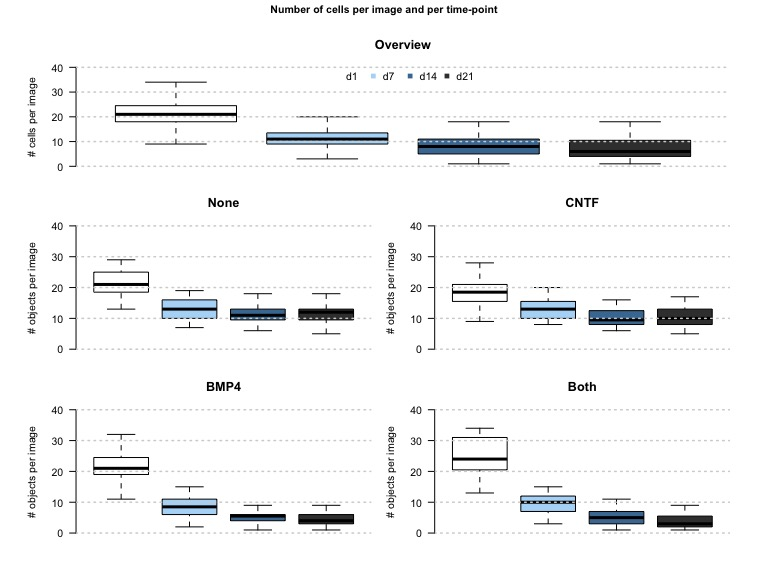<!-- -->

The number of cells per image decreases over time indicating potential
cell death.

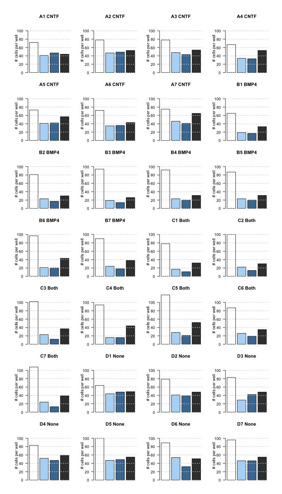<!-- -->

#### 2.2 Location of the detected object in the image

As shows in the next figure, the detected cells are for most located in
the upper part of the images, irrespective of the plate.

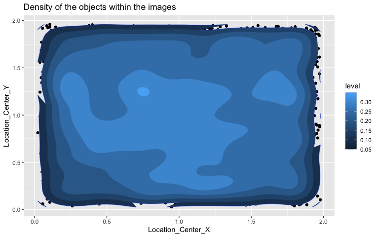<!-- -->

### 4\. Unsupervised data analysis

We next aimed at performing unsupervised data analysis of the
single-cell morphological changes over time in order to

1.  Determine whether the astrocyte morphologies gradually diverge over
    time in response to the distinct treatments;
2.  Identify morphological features that characterise the divergent
    trajectories.

#### 4.1 Create data and variable matrices

In order to perform unsupervised data analysis we first created 2
matrices from the data: 1) the metadata table which contains the fixed
effects including days, treatment, plate, well, and image number and 2)
the data-table which contain 5376 rows i.e. unique objects identified in
images with columns containing the different measurements obtained from
imaging. Notably in this analysis we will not use the location of the
cells.

We next applied log transformation to a selection of continuous
variables for which log-normality was tested, this in order to reduce
the influence of extreme values or outliers present in skewed data in
downstream analysis.

    ##  [1] "AreaShape_Area"               "AreaShape_BoundingBoxArea"   
    ##  [3] "AreaShape_Compactness"        "AreaShape_EquivalentDiameter"
    ##  [5] "AreaShape_FormFactor"         "AreaShape_MajorAxisLength"   
    ##  [7] "AreaShape_MaxFeretDiameter"   "AreaShape_MaximumRadius"     
    ##  [9] "AreaShape_MeanRadius"         "AreaShape_MedianRadius"      
    ## [11] "AreaShape_MinFeretDiameter"   "AreaShape_MinorAxisLength"   
    ## [13] "AreaShape_Perimeter"          "AreaShape_Zernike_0_0"       
    ## [15] "AreaShape_Zernike_1_1"        "AreaShape_Zernike_3_3"       
    ## [17] "AreaShape_Zernike_4_0"        "AreaShape_Zernike_5_5"       
    ## [19] "AreaShape_Zernike_7_7"        "AreaShape_Zernike_8_4"       
    ## [21] "AreaShape_Zernike_9_9"

#### 4.2. Inspect correlation between variables extracted from fluorescent images

We first aimed to test whether variables are correlating with each
other. As we can see in the following figure, which shows the Spearman
rank correlation between variables (invariant to log-transformation of
the data), the distinct variables associated with shapes are highly
correlating with each other, as do the measurements derived from GFP
intensities.

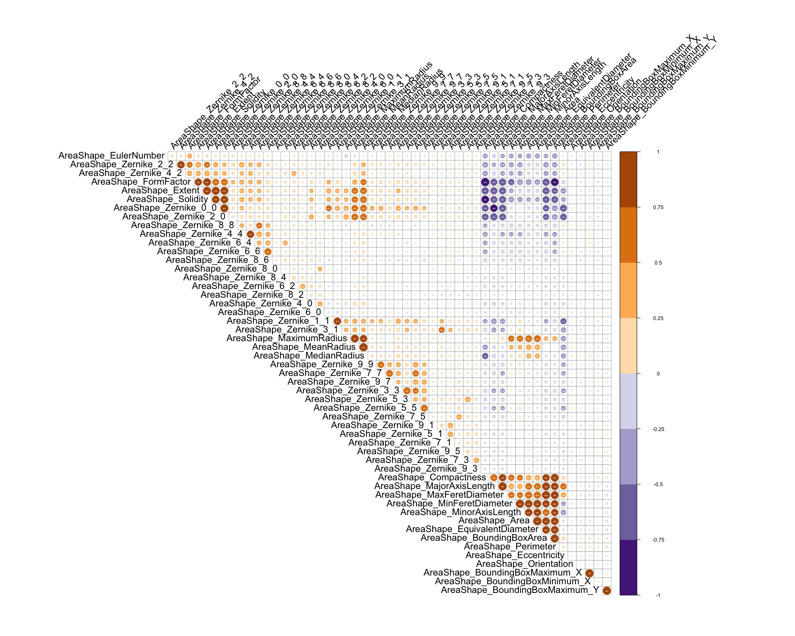<!-- -->

#### 4.3 Singular value decomposition analysis

As shown in the next figure, the information contained in data is for
most captured by the first component even after removing the ‘noise’.

SVD on the raw data:
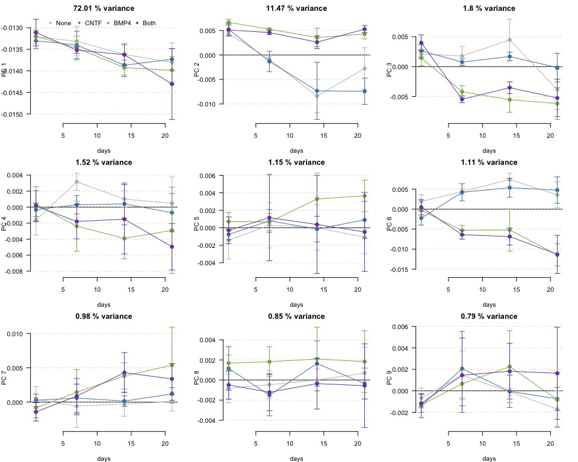<!-- -->

SVD on the normalised data:
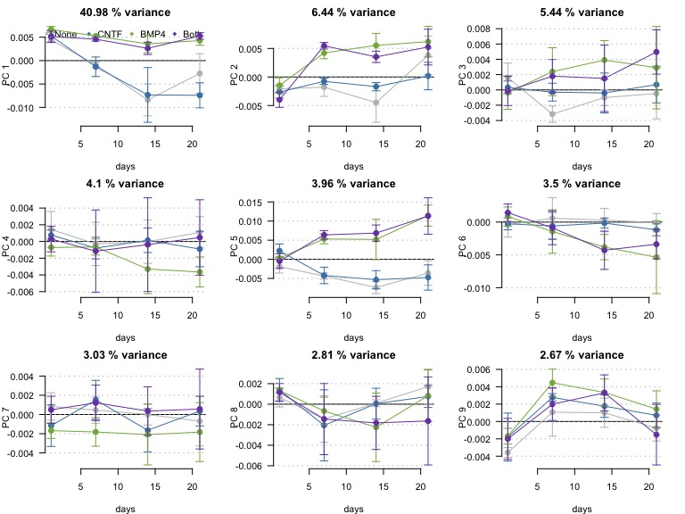<!-- -->

Let’s focus on the replicates of PC1:
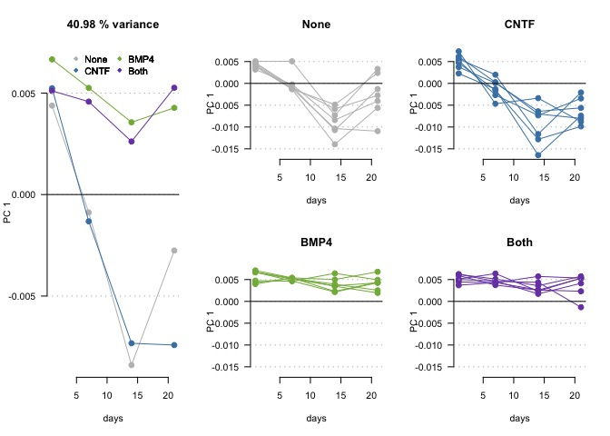<!-- -->

Looking at the scree plots confirm that the firts coomponent captures
most of the variance in morphological changes:
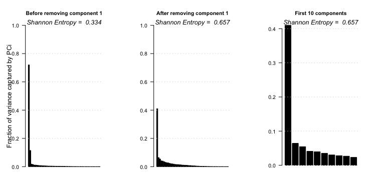<!-- -->

The next figure shows the dynamic over time of each component which can
be interpreted as the average cell population trajectories over time;
shown are the average and standard deviation of the projections/loadings
of each individual cell/astrocytes along the component of interest. The
large standard deviations suggest that heterogenous populations of cells
are present in each groups according to the measured parameters. This
will be further investigated in Section 5 of this document.

##### 4.3.1 Which component captures the treatment effect over time

We next aimed to identify what are the cofactors associated with each
component. Indeed in the current data-set, we have both the time in
culture as well as 3 types of treatments together with their
interactions. It is therefore important to determine whether a component
is associated with either of these covariates. To do this we iteratively
fitted a linear mixed model to the left singular vectors using as random
effects the well and image numbers, and as fixed effects the interaction
between the treatment and the time in culture. As shown in the next
figure, time is a significant explanatory variable for most components,
while TNF effect over time associates with the most contributing
components (PC1 and PC2). As expected FGF effect is a poor explanatory
variable.

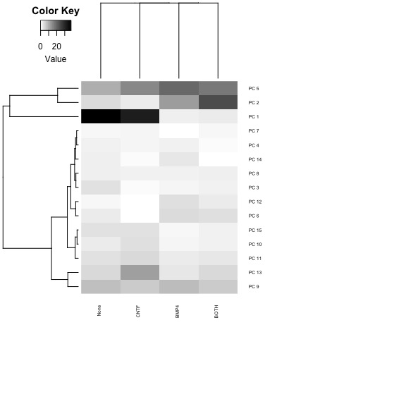<!-- -->

Next we can focus on PC1,2 and 5:

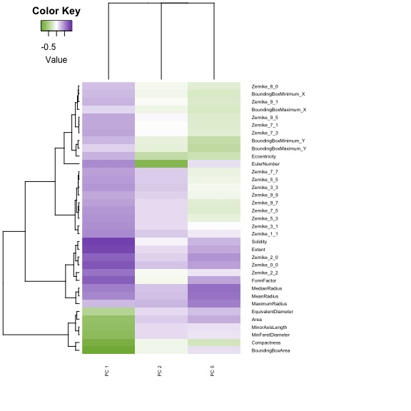<!-- -->

Finally we can look into the individual measurements:

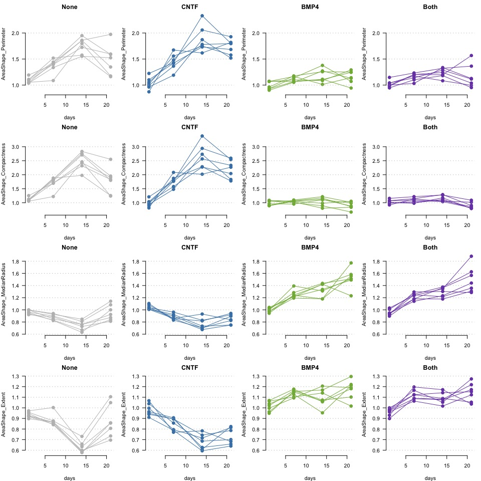<!-- -->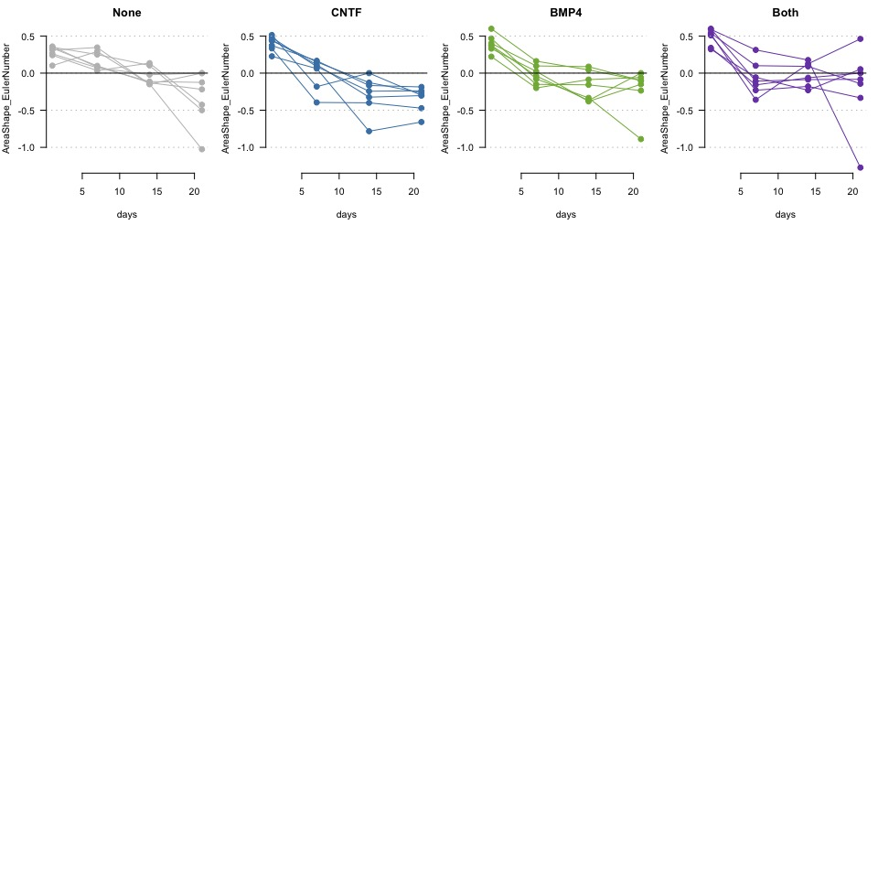<!-- -->
